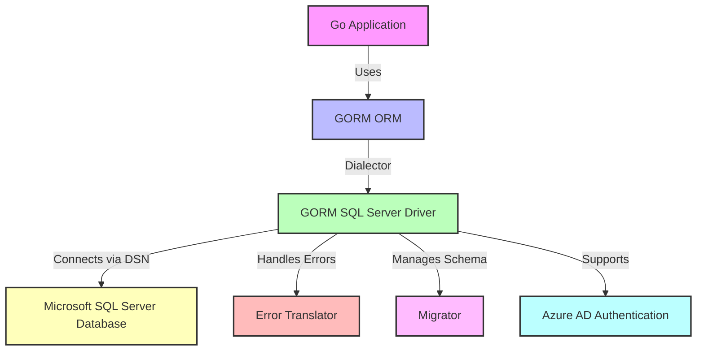

# Target Audience & Primary Use Cases

## Introduction

The GORM SQL Server Driver is meticulously designed for Go developers requiring seamless and robust connectivity with Microsoft SQL Server databases. This page identifies the ideal users and primary scenarios where leveraging this driver accelerates development, ensures security, and enhances productivity. Understanding who benefits most and how the driver fits into common workflows empowers developers to make informed decisions and harness the driver effectively.

---

## Who Should Use the GORM SQL Server Driver?

### Ideal Users

- **Go Developers and Teams** building applications that demand stable, performant, and feature-rich SQL Server integration.
- **Enterprise Application Developers** requiring advanced database capabilities like sophisticated schema migrations, transactional support, and detailed error handling tailored for Microsoft SQL Server.
- **Data-Driven Web Services** that rely on SQL Server for data storage, querying efficiency, and scalable transactional operations.
- **Projects Leveraging Azure AD Authentication** needing secure, cloud-friendly integration with SQL Server using Azure Active Directory tokens.
- **Developers Seeking Productivity** through ORM-based conveniences while retaining fine-grained control over SQL Server features and behavior.

---

## Primary Use Cases

### 1. Data-Driven Web and API Services

Applications that dynamically read, create, update, and delete data in SQL Server benefit greatly from this driver's native support for SQL Server’s T-SQL syntax, OUTPUT clauses, and identity management. Whether serving customer info, processing orders, or managing inventory, your service gains reliability and efficiency.

### 2. Enterprise Business Applications

Large-scale enterprise systems often demand comprehensive schema migration capabilities, precise control over indexes and constraints, and consistent error translation for robust transaction workflows. This driver integrates seamlessly with GORM’s migration tools, ensuring your application’s database schema evolves safely and predictably.

### 3. Cloud-Native Applications with Azure AD Authentication

By supporting a specialized driver configuration enabling Azure Active Directory authentication, the driver unlocks security enhancements for cloud applications connecting to Azure SQL databases. This is critical for organizations prioritizing identity management and access control.

### 4. Projects Requiring Advanced Schema and Index Management

If your application uses complex database schemas, custom views, indexes with specific uniqueness or conditional filters, or relies on extended properties like column comments, the driver’s powerful migrator handles these scenarios while maintaining SQL Server compatibility.

### 5. Applications Demanding Accurate Error Handling

The driver translates native SQL Server errors into standardized GORM errors, allowing your application to gracefully detect and respond to conditions such as duplicate keys or foreign key violations.

---

## How the Driver Fits Into Developer Workflows

### Incremental Schema Evolution

Developers can confidently use the migrator to create, rename, or drop tables, add or alter columns, and manage indexes without writing raw SQL. This aligns with agile development and continuous integration practices.

### Seamless Query Building

The driver implements SQL Server-specific clauses such as `LIMIT` with OFFSET and FETCH NEXT semantics and supports T-SQL features like OUTPUT to reflect inserted or updated data back into Go structs.

### Transparent Connection Management

You supply connection details using a Data Source Name (DSN), optionally configured for Azure AD authentication. The driver manages pooled connections internally or accepts custom connection pools, offering flexibility for different deployment environments.

### Unified Error Handling

By translating SQL Server error codes to GORM errors, the driver bridges SQL Server's native error world and Go application business logic, streamlining error handling strategies.

---

## Practical Example: Integrating Azure AD Authentication

```go
import (
  "github.com/microsoft/go-mssqldb/azuread"
  "gorm.io/driver/sqlserver"
  "gorm.io/gorm"
)

dsn := "sqlserver://username@yourserver.database.windows.net?database=yourdb"
dialector := &sqlserver.Dialector{Config: &sqlserver.Config{DSN: dsn, DriverName: azuread.DriverName}}
db, err := gorm.Open(dialector, &gorm.Config{})
if err != nil {
  // handle error
}
```

This example shows how easily you can configure the driver for Azure AD authentication, ensuring secure and smooth access to your cloud-hosted databases.

---

## Summary

The GORM SQL Server Driver empowers Go developers to build scalable, secure, and maintainable SQL Server-backed applications. Its thoughtful design fits naturally in varied workflows—from data-rich web services to enterprise apps demanding precise control and cloud-secure authentication mechanisms. By aligning with GORM’s idiomatic ORM patterns, it offers a seamless developer experience while fully leveraging SQL Server features.

---

## Next Steps

- Explore the [Core Features at a Glance](/overview/introduction-core-concepts/core-features-overview) to deepen your understanding of capabilities.
- Learn how schema migrations are managed on the [Managing Schema Migrations](/guides/database-operations/schema-migrations) page.
- For secure cloud connections, visit [Connecting with Azure AD Authentication](/guides/getting-started/azure-ad-auth).
- Begin with the [Configuration & First Connection](/getting-started/setup-and-installation/configuration-and-first-connection) guide to integrate quickly.

---

<KeyValue>
- **Target Audience:** Go developers using SQL Server databases
- **Use Cases:** Data-driven applications, enterprise systems, cloud secure apps
- **Benefits:** Efficient schema migration, advanced error handling, Azure AD support
</KeyValue>

---

## Troubleshooting Tips

- Ensure your connection string (DSN) is correctly formatted and includes required credentials.
- When using Azure AD authentication, confirm that the driver’s configuration specifies the Azure AD driver name.
- If migrations fail, verify SQL Server permissions and schema names.
- Utilize error translation to handle specific SQL Server error scenarios gracefully.

---

## Visual Context: Integration Workflow Overview



This workflow illustrates the role of the SQL Server driver within your Go application ecosystem, showcasing error handling, schema management, and secure authentication support.

---

## Additional Resources

- [Official GORM Site](https://gorm.io)
- [Microsoft SQL Server Error Codes](https://learn.microsoft.com/en-us/sql/relational-databases/errors-events/database-engine-events-and-errors)
- [Azure AD Authentication for SQL Server](https://learn.microsoft.com/en-us/azure/azure-sql/database/authentication-aad-overview)


---